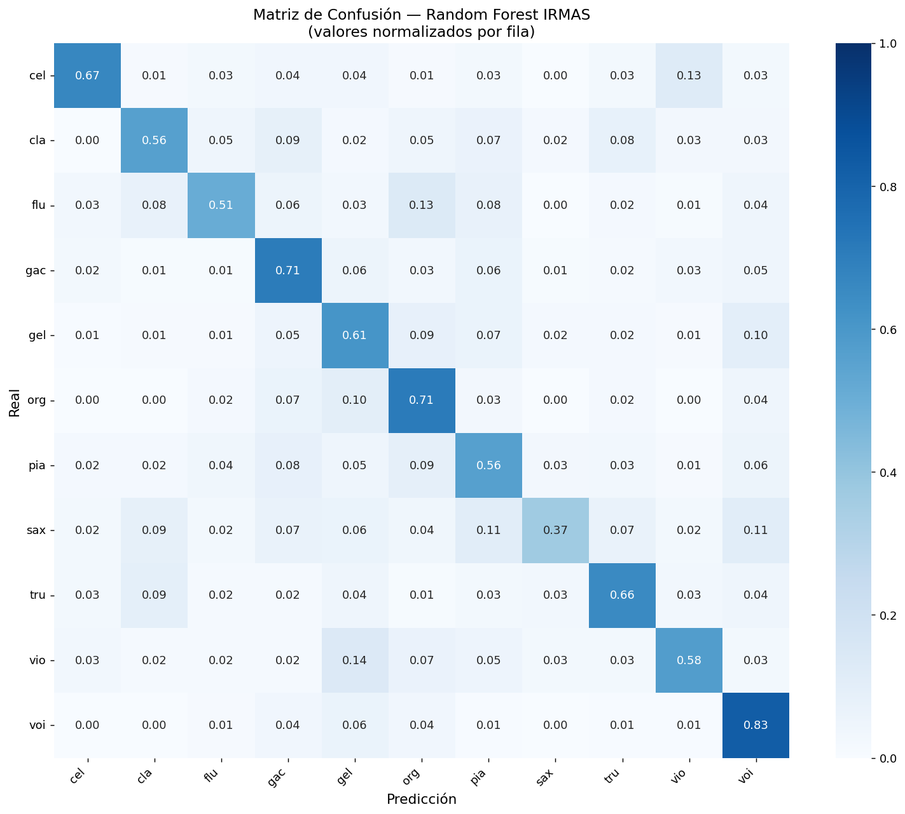
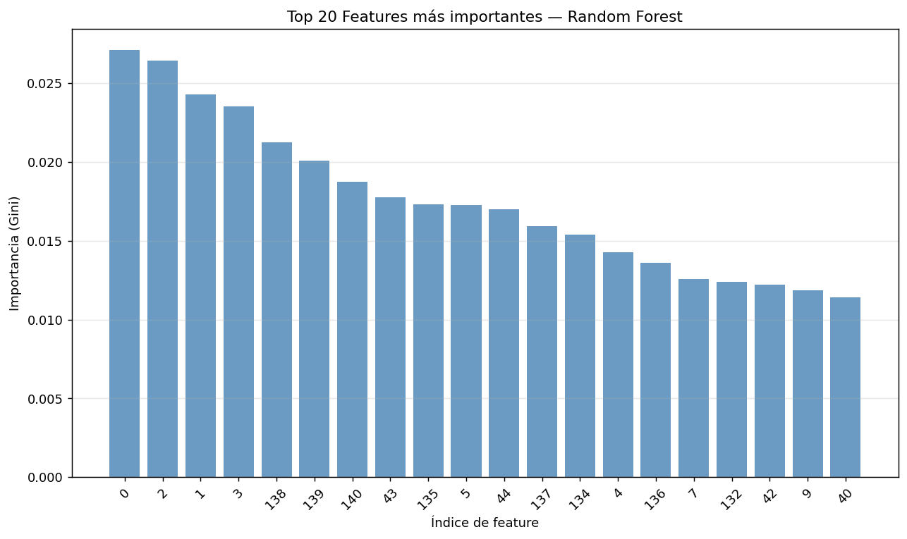

# Instrument Detector

## Autores

- Juan José Escobar
- Juan David Salas

*Curso: Introducción a la Inteligencia Artificial — EAFIT 2026-1*

Sistema de identificación de instrumentos musicales en audio usando Inteligencia Artificial. Dado un archivo de audio, el sistema detecta qué instrumentos están presentes y en qué momentos de la canción, usando dos modelos complementarios: un Audio Spectrogram Transformer (AST) preentrenado en AudioSet y un clasificador Random Forest entrenado sobre el dataset IRMAS.

---

## Planteamiento del Problema

La identificación automática de instrumentos musicales (Automatic Music Instrument Recognition, AMIR) es un problema abierto en el área de Music Information Retrieval (MIR). A diferencia de la separación de fuentes, que aísla las pistas de cada instrumento como audio independiente, la identificación determina qué instrumentos están presentes en una mezcla sin necesidad de separarlos.

Este problema tiene aplicaciones directas en catalogación automática de música, asistencia a músicos y productores, análisis musicológico a gran escala, y sistemas de recomendación musical basados en instrumentación. Herramientas comerciales como Moises.AI o iZotope RX abordan problemas relacionados, pero su enfoque principal es la separación de fuentes, no la identificación y análisis de presencia temporal.

El reto principal es que los instrumentos rara vez suenan de forma aislada en grabaciones reales — se mezclan, se superponen y comparten rangos de frecuencia, lo que dificulta la separación de sus características individuales mediante técnicas de procesamiento de señal clásicas.

---

## Objetivo General

Desarrollar un sistema funcional de identificación de instrumentos musicales en audio que integre dos enfoques de Inteligencia Artificial — redes neuronales profundas preentrenadas y aprendizaje de máquina clásico — presentados mediante una interfaz web interactiva con un asistente conversacional que interprete y explique los resultados al usuario.

---

## Metodología

El sistema sigue un pipeline de análisis por segmentos: el audio se divide en ventanas temporales, cada ventana se analiza independientemente, y los resultados se agregan para producir un análisis global y una línea de tiempo de presencia de instrumentos.

### Temas del curso aplicados

| Tema | Aplicación en el proyecto |
|---|---|
| **Redes Neuronales** | Audio Spectrogram Transformer (AST) — arquitectura Transformer de 12 capas de atención |
| **Aprendizaje de Máquina** | Random Forest entrenado sobre features de audio del dataset IRMAS |
| **Optimización** | RandomizedSearchCV para búsqueda automática de hiperparámetros óptimos |
| **Procesamiento de Lenguaje Natural** | Bot conversacional con Claude Haiku para interpretación de resultados |

### Diagrama de flujo

```
Audio de entrada
        │
        ▼
┌──────────────────┐
│  Carga y         │
│  preprocesamiento│  librosa → mono, 16kHz (AST) / 22kHz (RF)
└────────┬─────────┘
         │
         ▼
┌─────────────────────────────────────────┐
│         Segmentación temporal           │
│   Ventanas de 5s (AST) / 3s (RF)        │
└────────────────┬────────────────────────┘
                 │
        ┌────────┴────────┐
        ▼                 ▼
┌───────────────┐   ┌──────────────────────┐
│  Modelo AST   │   │   Modelo RF + IRMAS  │
│               │   │                      │
│ Espectrograma │   │ Extracción MFCCs,    │
│ mel → Trans-  │   │ Chroma, Contrast,    │
│ former →      │   │ ZCR, RMS → Random    │
│ 527 categorías│   │ Forest → 11 clases   │
└──────┬────────┘   └──────────┬───────────┘
       │                       │
       ▼                       ▼
┌──────────────────────────────────────────┐
│   Filtrado y renormalización             │
│   Solo categorías de instrumentos        │
│   Promedio de probabilidades por segmento│
└─────────────────┬────────────────────────┘
                  │
                  ▼
┌──────────────────────────────────────────┐
│   Visualización                          │
│   - Gráfico de barras (confianza)        │
│   - Línea de tiempo (AST)                │
│   - Bot conversacional (Claude Haiku)    │
└──────────────────────────────────────────┘
```

---

## Desarrollo

### Datos

**AudioSet (Google, 2017)**
Base de datos de 2 millones de clips de audio de 10 segundos etiquetados en 527 categorías de sonidos del mundo real, incluyendo instrumentos musicales. Usado como dataset de preentrenamiento del modelo AST. No se descarga localmente — se accede a través del modelo preentrenado en HuggingFace.

**IRMAS (Instrument Recognition in Musical Audio Signals)**
Dataset especializado en reconocimiento de instrumentos musicales con 6,705 clips de audio de 2-3 segundos, cada uno con un instrumento predominante claramente identificado. Cubre 11 clases: Cello, Clarinete, Flauta, Guitarra acústica, Guitarra eléctrica, Órgano, Piano, Saxofón, Trompeta, Violín y Voz. Usado para entrenar el modelo Random Forest propio.

### Modelo 1 — Audio Spectrogram Transformer (AST)

El AST es una arquitectura de red neuronal profunda basada en Vision Transformer (ViT) adaptada para audio. El proceso es:

1. El audio se convierte a un espectrograma mel de 128 bandas de frecuencia
2. El espectrograma se divide en patches de 16×16 píxeles
3. Cada patch se proyecta a un embedding de 768 dimensiones
4. Los embeddings pasan por 12 capas de atención multi-cabeza (Multi-Head Self-Attention)
5. La capa de clasificación produce probabilidades sobre 527 categorías

Se usa el modelo `MIT/ast-finetuned-audioset-10-10-0.4593` disponible en HuggingFace, resultado de un proceso de transfer learning desde ViT preentrenado en ImageNet hacia el dominio del audio mediante fine-tuning sobre AudioSet.

Las probabilidades se filtran para retener solo categorías de instrumentos y se renormalizan para que sumen 100%, representando la presencia relativa de cada instrumento en el segmento analizado.

### Modelo 2 — Random Forest sobre IRMAS

Se entrenó un clasificador Random Forest sobre features extraídas con librosa de los 6,705 clips del dataset IRMAS.

**Features extraídas por clip (141 dimensiones totales):**

| Feature | Dimensiones | Qué captura |
|---|---|---|
| MFCCs (media) | 40 | Timbre y color tonal |
| MFCCs (std) | 40 | Variabilidad del timbre |
| Delta MFCCs | 40 | Cambios temporales del timbre |
| Chroma | 12 | Contenido armónico y tonal |
| Spectral Contrast | 7 | Diferencia entre picos y valles espectrales |
| ZCR | 1 | Velocidad de la señal (relacionada con frecuencia) |
| RMS | 1 | Energía promedio de la señal |

**Pipeline de entrenamiento:**
1. Extracción paralela de features con `joblib` (16 workers) — 6,705 clips en ~25 segundos
2. Caché de features en `.npz` para reentrenamientos instantáneos
3. Balanceo con SMOTE sobre el espacio de features (no sobre audio crudo)
4. Búsqueda de hiperparámetros con RandomizedSearchCV (50 iteraciones, cv=5)
5. Evaluación sobre 20% de datos reservados (test set estratificado)

**Mejores hiperparámetros encontrados:**

✅ RandomizedSearchCV completado en 2306.9s
   Mejores parámetros: {'n_estimators': 600, 'min_samples_split': 3, 'min_samples_leaf': 1, 'max_features': 0.4, 'max_depth': 20, 'criterion': 'gini'}
   Mejor F1 (CV):      0.7416

| Parámetro | Valor |
|---|---|
| n_estimators | 600 |
| Criterion | gini |
| max_depth | 20 |
| min_samples_split | 3 |
| min_samples_leaf | 1 |
| max_features | 0.4 | -> 40% * 141 ~ 56

### Interfaz y Bot

La interfaz web se construyó con Gradio (`gr.Blocks`) y permite seleccionar entre los dos modelos mediante botones separados. Los resultados se presentan como gráfico de barras de confianza y línea de tiempo de presencia temporal (AST).

El bot conversacional usa Claude Haiku (Anthropic) con un system prompt que incluye el contexto del último análisis realizado, permitiendo al usuario hacer preguntas sobre los instrumentos detectados, las métricas de confianza, y el funcionamiento del sistema.

---

## Resultados

### Modelo AST

El AST detecta instrumentos como presencia relativa en el espacio de 527 categorías de AudioSet. Los resultados se presentan como porcentaje de presencia relativa entre los instrumentos identificados en cada segmento de 5 segundos.

Ejemplos de detección correcta:
- **Blackbird (The Beatles):** Guitarra acústica como instrumento dominante
- **Careless Whisper (George Michael):** Saxofón detectado como instrumento principal
- **Hotel California (Eagles):** Guitarra eléctrica, guitarra acústica y percusión identificadas

### Modelo Random Forest — IRMAS

```
=== RESULTADOS EN TEST SET ===
              precision    recall  f1-score   support

         cel       0.72      0.67      0.69        78
         cla       0.60      0.56      0.58       101
         flu       0.62      0.51      0.56        90
         gac       0.58      0.71      0.64       127
         gel       0.55      0.61      0.58       152
         org       0.59      0.71      0.64       136
         pia       0.57      0.56      0.56       144
         sax       0.73      0.37      0.49       125
         tru       0.67      0.66      0.66       116
         vio       0.69      0.58      0.63       116
         voi       0.66      0.83      0.74       156

    accuracy                           0.62      1341
   macro avg       0.63      0.62      0.62      1341
weighted avg       0.63      0.62      0.62      1341
```





Los índices corresponden al vector de 141 features concatenadas:
- **Índices 0–39:** MFCCs media — los más importantes, capturan el timbre fundamental
- **Índices 40–79:** MFCCs desviación estándar — variabilidad del timbre
- **Índices 132–138:** Spectral Contrast — aparece en top 10, confirma que la diferencia entre picos y valles espectrales es discriminante entre instrumentos
- **Índices 139–140:** ZCR y RMS — presentes en top 10, la energía y velocidad de la señal complementan el timbre

Los primeros 4 coeficientes MFCC dominan la importancia, lo cual es consistente con la literatura: los MFCCs de bajo orden capturan la envolvente espectral general que define el timbre de cada instrumento.

### Comparación de enfoques

| Aspecto | AST | Random Forest |
|---|---|---|
| Tipo de modelo | Red neuronal (Transformer) | Aprendizaje de máquina clásico |
| Dataset de entrenamiento | AudioSet (2M clips, 527 clases) | IRMAS (6,705 clips, 11 clases) |
| Instrumentos detectables | 527 categorías | 11 instrumentos |
| Genera línea de tiempo | ✅ | ❌ |
| Requiere GPU para inferencia | Opcional | No |
| Fortaleza | Cobertura amplia, más datos de entrenamiento, detección temporal | Especializado en instrumentos musicales |

---

## Discusión

### Estado del arte y trabajos relacionados

**Moises.AI** es la herramienta más cercana en el mercado, pero aborda un problema diferente: separación de fuentes (*source separation*) usando Demucs (Meta AI), que produce pistas de audio aisladas para voz, batería, bajo y otros. Nuestro sistema hace identificación, no separación — son enfoques complementarios.

**Google AudioSet + YAMNet** es la base del modelo AST utilizado. YAMNet es una CNN liviana alternativa al AST para clasificación de audio en tiempo real, con menor precisión pero mayor velocidad.

**Essentia (MTG)** es una librería de análisis musical que incluye modelos para identificar instrumentos, géneros, estados de ánimo y otras características de alto nivel en canciones, entrenados sobre datasets propietarios con mayor cobertura que IRMAS.

### Limitaciones

La principal limitación del modelo Random Forest es el **domain mismatch**: IRMAS contiene clips de instrumentos que, aunque sean bastantes, no reflejan totalmente la diversidad que existe en el mundo musical. Existen todo tipos de canciones, donde el mismo instrumento se superpone con otros, se tocan afinaciones u técnicas diferentes, con efectos o uso de software que modifican el sonido original del instrumento, etc.

El AST hereda las limitaciones de AudioSet: las probabilidades son bajas en valor absoluto porque compiten contra 527 categorías, incluyendo muchas no musicales. La renormalización mitiga esto pero no elimina la ambigüedad inherente. Este modelo trata de responder más a la pregunta de "¿Qué es este sonido? (la canción en su totalidad)", que a si en dicho audio subido se identifica tal instrumento específico.

Como trabajo futuro, el fine-tuning del AST sobre IRMAS o sobre el dataset OpenMIC-2018 combinaría lo mejor de ambos enfoques: la capacidad representativa de los Transformers con datos especializados en instrumentos musicales.

---

## Instalación y uso

### Requisitos

- Python 3.10+
- CUDA opcional (recomendado para inferencia más rápida con AST)

### Instalación

```bash
git clone https://github.com/Jjes07/IA_final.git
cd IA_final
pip install -r requirements.txt
```

### Configuración

Crea un archivo `.env` en la raíz del proyecto:
```
ANTHROPIC_API_KEY="sk-ant-..."
```

### Uso

**Lanzar la interfaz:**
```bash
python app.py
```
Abre `http://localhost:8000` en el navegador.

**Entrenar el modelo Random Forest (opcional):**
```bash
python model_irmas.py
```
Nota: El entrenamiento puede tardar varios minutos u horas debido al algoritmo Random Search. Requiere el dataset IRMAS en `dataset/IRMAS-TrainingData/`. El modelo entrenado se guarda automáticamente como `irmas_model.pkl`.

### Estructura del proyecto

```
IA_final
├── app.py                          # Interfaz Gradio principal
├── model.py                        # Modelo AST + pipeline de análisis
├── model_irmas.py                  # Modelo Random Forest + entrenamiento
├── bot.py                          # Bot conversacional (Claude Haiku)
├── requirements.txt
├── .env                            # API key
├── .gitignore
├── irmas_model.pkl                 # Modelo entrenado (generado al entrenar)
├── irmas_encoder.pkl               # Label encoder (generado al entrenar)
├── assets/
│   └── demo_songs/                 # Canciones de ejemplo para la demo
│       ├── Blackbird.mp3
│       ├── Hotel California.mp3
│       └── Careless Whisper.mp3
├── dataset/
│   └── IRMAS-TrainingData/         # Dataset IRMAS (no subir a Git)
└── metrics/
├── confusion_matrix.png        # Generada al entrenar
└── feature_importance.png      # Generada al entrenar
```

## Conclusiones

- La combinación de dos modelos complementarios permite abordar el problema desde perspectivas distintas: el AST ofrece cobertura amplia y análisis temporal, mientras que el Random Forest ofrece clasificación especializada.
- El principal desafío del problema es el domain mismatch: los modelos entrenados con instrumentos aislados (IRMAS) tienen dificultades con mezclas reales, limitación documentada en la literatura de MIR.
- SMOTE aplicado sobre el espacio de features (no sobre audio crudo) permitió mejorar el F1 macro de 53% a 62% compensando el desbalance natural del dataset.
- La búsqueda de hiperparámetros con RandomizedSearchCV (50 iteraciones, cv=5) identificó que `max_features=0.4` con árboles más profundos (`max_depth=20`) supera a las configuraciones más conservadoras para este dominio.
- Como trabajo futuro, el fine-tuning del AST sobre IRMAS o OpenMIC-2018 combinaría la capacidad representativa de los Transformers con datos especializados en instrumentos.

### Referencias

- Moises.AI — separación de fuentes con IA: https://moises.ai
- Gemmeke, J. et al. (2017). *Audio Set: An ontology and human-labeled dataset for audio events*. Google Research. https://research.google.com/audioset/
- YAMNet — clasificación de audio con MobileNet: https://www.kaggle.com/models/google/yamnet
- Essentia — librería de análisis musical (MTG-UPF): https://essentia.upf.edu
- Bosch, J. J., Janer, J., Fuhrmann, F., & Herrera, P. IRMAS. https://www.upf.edu/web/mtg/irmas
- Hugging Face. *AST: Audio Spectrogram Transformer*. https://huggingface.co/docs/transformers/model_doc/audio-spectrogram-transformer